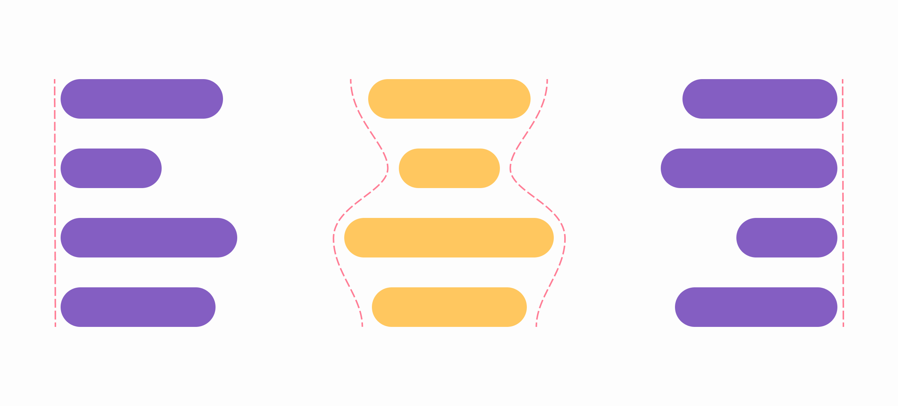
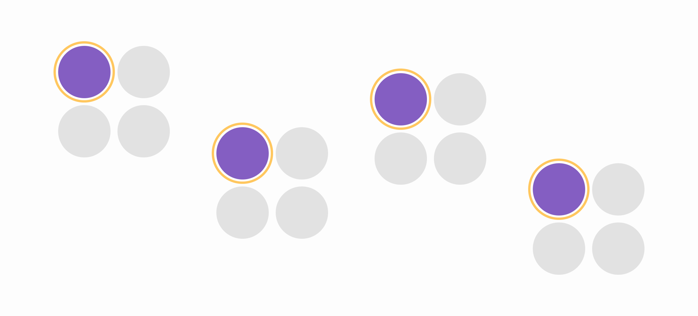
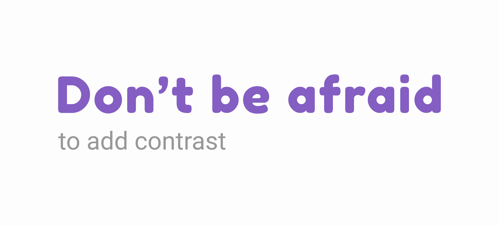

I read [The Non-Designer's Design Book (Japanese Edition)](https://amazon.co.jp/dp/4839955557), so I'll summarize what the four design principles are and explain how to apply them to the design.

## The four design principles
The four design principles include contrast, repetition, alignment and proximity.

<!-- ### Contrast
The purpose of making contrast is to avoid being similar. If the element is different from others, it should be differentiated clearly. Contrast makes readers want to read and can clearly convey information.

### Repetition
Repetition helps organize and strengthen unification. Design elements that can be used to make repetition include color, texture, positional relationship, line thickness, font size, image concept, and so on.

### Alignment
You should place everything intentionally on the page. Every element has a visual relationship with other elements. Alignment generates a clean and sophisticated look.

### Proximity
Proximity helps organize information, reduce confusion, and present a clear structure to the reader. You should closer related items for grouping. -->

I will explain each principle further in the sections below.

This book describes them in order of proximity, alignment, repetition, and contrast. This is the order of applying to the design, so I'll follow that order as well.

## Proximity
When designing a page, just scattering the design elements makes the page chaotic. Designers should always be careful that elements are near enough the element to which it belongs.

Here are some important points of proximity.

1. Visually relate what is perceptually related, keep away unrelated elements or element groups.
2. Be aware of the line of sight, where to start reading, what path to take, where to end, and where to look after reading.
3. The purpose of proximity is organizing information. More space will be generated as a byproduct of proximity.

You can tell the number of visual groups by gazing at the page with a slight squint and counting the number of eyes stopped.

## Alignment
Everything on the page must be consciously placed. Alignment can make a visual and psychological relationship even if the elements are apart from each other.

Center alignment may look weak because the edge lines are soft. Left or right alignment makes stronger edge lines.

Center alignment gives the impression of formal, quiet and normal but sometimes looks boring. Thus, if you use center alignment, be aware of the effects and try other ways to make the design more dramatic.

Here are some points of alignment.
1. Train your eyes to notice the transparent connected lines.
2. Find strong lines in such elements as images or illustrations, and use them.
3. Try not to use center alignment. When using center alignment, choose consciously and be aware of the effect.

## Repetition
The principle of repetition is to repeat some design features through the work such as bold fonts, bold lines, burette types, format, layout, space, etc. In brief, **you can repeat anything the reader can visually recognize**.

Repetition can make **consistency** in the design, help **organize information** and help **unify the distant parts of the design**.

The basic purpose of repetition is to add unity and visual fun. Repeating the visual elements throughout the design connects the isolated parts, unifying and strengthening the work.

#### How to use it?
1. Find repetitions that already exist and enhance them.
2. Once you get the idea and perspective of repetition, begin to "create" repetition that enhances the clarity of information in the design.

## Contrast
The purpose of contrast is to create fun on the page and help organize information.

Contrast can be made in various ways (e.g. big and small text, elegant old font style and strong san-serif font, thin and thick lines, cold and warm color, smooth and rough texture, loose and tight line spacing, etc.).

Contrast can:
1. Add visual fun to the page
2. Organize information
3. Clarify hierarchies
4. Guide on pages
5. Create focus

Don't be afraid to make elements smaller to contrast with the larger items. Don't be afraid to create space. Once the reader is drawn into the focal point and interested in the content, they will read even smaller items.

When adding contrast between different elements, make it distinctly different.

## Summary
All the principles of proximity, alignment, repetition and contrast work together to create the overall effect.
The key points of designing the page are as follows.
1. Proximity - Organize information into logical groups.
2. Alignment - Find strong lines and consciously align elements.
3. Repetition - Add consistency and organize information by repeating elements.
4. Contrast - If the elements are not exactly the same, make it distinctly different.