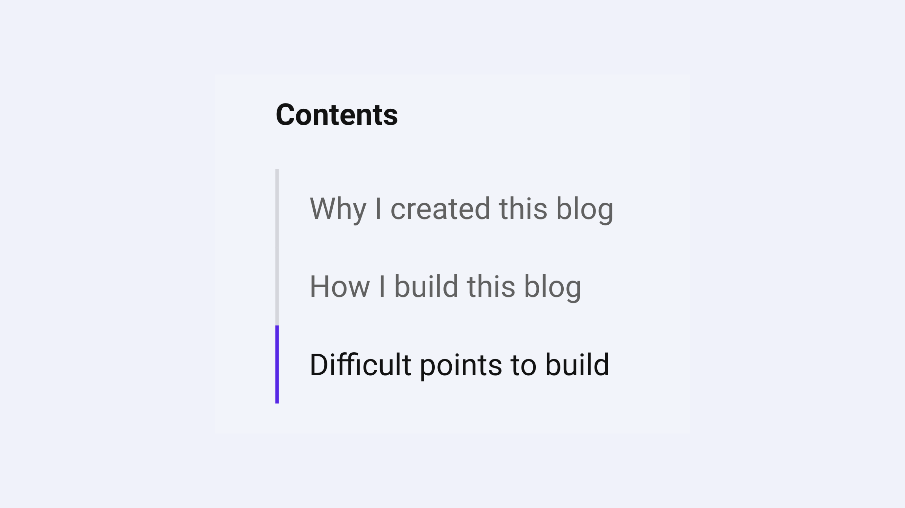

I will explain why and how I created this blog site.
## Why I created this blog

I created this blog as I just wanted to create a website and try Gatsby, inspired by [CatNose's blog](https://catnose99.com/).

It's good to have a place where I can write about my thoughts and keep records of my works.

## How I build this blog

This blog is created with [Gatsby](https://www.gatsbyjs.com/) and hosted by [Netlify](https://www.netlify.com/).
I can write posts as markdown, up files to GitHub, and they are automatically deployed by Netlify.

## Difficult points to build
There were a few challenging points I faced while developing.
#### Table of contents
[[imageMedium]]
| 

I struggled to make this chasing table of contents feature.
It was solved thanks to [https://nickymeuleman.netlify.app/blog/table-of-contents](https://nickymeuleman.netlify.app/blog/table-of-contents).

#### Search function
It was difficult to find a way of building a smooth search function. I still try to improve it.